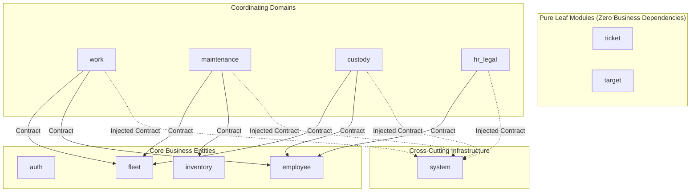

# AAMS Backend — Phase 0 Architectural Audit & Foundation Report

**Execution Date:** 2026-10-03  
**Status:** COMPLETE (Zero Code Regressions / Zero Schema Modifications)  
**Git Checkpoint Commit:** `be2f3a75b8931eeaf0361e073c19d4b9de77a73d`  
**Git Branch:** `main`

---

## 1. Executive Summary

This report concludes **Phase 0 (Baseline & Foundation Audit)** for the **AAMS Backend**.
All existing 21,332 lines of Go code across 37 source files have been exhaustively indexed, verified against `go build`, `go vet`, and `go test`, and cataloged into 11 strictly defined Bounded Contexts.

### Key Achievements in Phase 0:
- **Baseline Integrity:** All compilation and static analysis checks pass with 0 errors.
- **Full Inventory:** Complete documentation of all 110+ HTTP API routes, 46 database tables, and all cross-module transaction boundaries.
- **Zero Invasiveness:** No application code was altered, no database schema was modified, and zero business rules were mutated.

---

## 2. Baseline Results

- **Toolchain:** `go1.27.1 windows/amd64`
- **`go build ./...`:** SUCCESS (0 compilation errors)
- **`go vet ./...`:** SUCCESS (0 static analysis warnings)
- **`go test ./...`:** PASS (0 test suites currently configured)
- **Baseline Document:** [`docs/architecture/phase-0-baseline.md`](file:///d:/AAMS/backend/docs/architecture/phase-0-baseline.md)

---

## 3. Backend Inventory

| Physical Package | Go Files | Lines of Code | Responsibility | Risk Level |
|---|---|---|---|---|
| `internal/service` | 7 | 7,632 | Core business rules across all domains | **Critical** |
| `internal/handler` | 5 | 4,903 | HTTP Controllers, param binding, and JSON responses | **High** |
| `internal/repository` | 3 | 3,777 | GORM database queries and persistence | **High** |
| `internal/dto` | 3 | 1,271 | DTO schemas for API contracts | **Medium** |
| `internal/domain` | 3 | 974 | GORM models and entity declarations | **Medium** |
| `cmd/api` | 1 | 689 | Main bootstrap and route registrations | **High** |
| `pkg/database` | 1 | 422 | Connection pool & migrations | **Medium** |
| `pkg/middleware` | 3 | 277 | Auth JWT, Security Headers, Rate Limiter | **High** |
| `cmd/*` (CLI tools) | 8 | 1,077 | Benchmarks and manual scripts | **Low** |
| `pkg/*` (other) | 3 | 310 | Backup, JWT, Barcode | **Low** |
| **Total Backend** | **37** | **21,332** | Entire System | - |

---

## 4. Large File Analysis (> 500 Lines)

```text
1. internal/service/services.go         : 5,454 lines (Extreme Giant File - Contains 10+ distinct domains)
2. internal/handler/handlers.go         : 3,747 lines (Extreme Giant File - Monolithic controller struct)
3. internal/repository/gorm_repo.go     : 3,030 lines (Extreme Giant File - Monolithic repository struct)
4. internal/service/target_service.go   : 1,086 lines (Large File - Target imports & platform sync)
5. internal/dto/dtos.go                 : 1,018 lines (Large File - Monolithic DTOs)
6. internal/domain/models.go            : 779 lines   (Large File - Monolithic DB models)
7. cmd/api/main.go                      : 689 lines   (Large File - Manual wiring of 27 services)
8. internal/service/excel_import_service.go: 601 lines(Large File - Excel parsing)
```

---

## 5. API Inventory Summary

- **Total Registered Endpoints:** **112 Routes**
- **Authentication Breakdown:**
  - Public / Unauthenticated: **16 Routes** (Login, Refresh, Health, Performance, Public Docs QR)
  - JWT Protected: **96 Routes** (Work, Fleet, Employees, Custody, Inventory, Targets, Admin RBAC)
- **Detailed API Mapping:** [`docs/architecture/api-inventory.md`](file:///d:/AAMS/backend/docs/architecture/api-inventory.md)

---

## 6. Database / Table Ownership Matrix (11 Bounded Contexts)

| # | Table Name | Owning Module | Authorized Readers | Authorized Writers | Cross-Module Access Policy |
|---|---|---|---|---|---|
| 1 | `admins`, `roles`, `permissions`, `admin_permissions`, `otp_requests` | **`auth`** | `auth`, Middleware | `auth` exclusively | `IPermissionChecker`, `IAuthVerifier` |
| 2 | `employees`, `employee_login_logs`, `documents`, `bank_accounts`, `promissory_notes` | **`employee`** | All Modules | `employee` exclusively | `IEmployeeContract` |
| 3 | `work_sessions`, `shift_reviews` | **`work`** | `work`, `hr_legal` | `work` exclusively | `IWorkSessionContract` |
| 4 | `vehicles`, `oil_change_rules` | **`fleet`** | `fleet`, `work`, `maintenance`, `custody` | `fleet` exclusively | `IVehicleFleetContract` |
| 5 | `maintenance_records`, `oil_changes`, `maintenance_requests`, `maintenance_request_logs` | **`maintenance`** | `maintenance`, `fleet` | `maintenance` exclusively | `IMaintenanceContract` |
| 6 | `inventory_items`, `stock_transactions`, `purchase_invoices`, `purchase_invoice_items` | **`inventory`** | `inventory`, `maintenance` | `inventory` exclusively | `IInventoryStockContract` |
| 7 | `targets`, `target_tiers`, `platform_mappings`, `target_logs`, `import_batches`, `import_jobs` | **`target`** | `target` | `target` exclusively | `ITargetReader` |
| 8 | `custody_days`, `custody_expenses`, `fuel_logs`, `custody_audit_logs` | **`custody`** | `custody` | `custody` exclusively | `ICustodyContract` |
| 9 | `investigations`, `administrative_orders`, `advances`, `leaves`, `leave_balances`, `attendances`, `attendance_logs`, `traffic_violations` | **`hr_legal`** | `hr_legal`, `employee` | `hr_legal` exclusively | `IHRActionContract` |
| 10 | `tickets`, `ticket_replies` | **`ticket`** | `ticket` | `ticket` exclusively | `ITicketContract` |
| 11 | `audit_logs`, `system_metrics`, `notifications`, `announcements`, `announcement_votes`, `fcm_tokens`, `settings`, `branches`, `outbox_events` | **`system`** | `system` | `system` exclusively | `IAuditLogger`, `INotificationSender`, `IOutboxDispatcher` |

---

## 7. Transaction Audit

- **Audit Findings:** Identified missing atomicity in cross-domain mutations (e.g., `RecordOilChange` updating vehicle KM, maintenance records, and inventory without a unified UnitOfWork).
- **Approved Target Architecture:** `UnitOfWork` with `TransactionSession` abstraction where the primary service owns the transaction lifetime.
- **Detailed Audit Document:** [`docs/architecture/transaction-audit.md`](file:///d:/AAMS/backend/docs/architecture/transaction-audit.md)

---

## 8. Outbox Foundation

- **Owning Module:** `modules/system`
- **Table:** `outbox_events`
- **Schema Fields:**
  `id (UUID)`, `event_type`, `aggregate_type`, `aggregate_id`, `payload (JSONB)`, `status (PENDING, PROCESSING, PROCESSED, FAILED)`, `retry_count`, `max_retries (default 5)`, `last_error`, `idempotency_key`, `created_at`, `processing_at`, `processed_at`.
- **Worker Concurrency & Recovery:**
  - Polling uses `SELECT ... FOR UPDATE SKIP LOCKED`.
  - Watchdog recovers stale records where `status = 'PROCESSING'` and `processing_at < NOW() - INTERVAL '5 minutes'`.
  - **Idempotency Rule:** Every consumer MUST be idempotent using `event_id` or `idempotency_key`.

---

## 9. Audit Classification

1. **Critical / Durable Audit:**
   - *Scope:* Permission changes, salary advances, traffic violation deductions, branch custody closure, employee status changes.
   - *Mechanism:* Synchronous persistence inside the active DB transaction.
2. **Operational / Telemetry Logs:**
   - *Scope:* API route latency, HTTP access logs, system performance metrics.
   - *Mechanism:* Asynchronous buffered channel (`chan AuditEvent`, buffer 1000).

---

## 10. Failure Isolation Matrix

| Component | Failure Mode | Current Behavior | Target Isolation Mechanism |
|---|---|---|---|
| **FCM Push Notification** | Network timeout / Firebase 5xx | Synchronous call in some handlers | Asynchronous Safe Worker with Retry Queue |
| **Excel Target Ingestion** | OOM or DB lock during large file | Synchronous HTTP loop | Chunked Background Job with Progress State |
| **DB Backup Cron** | Disk I/O spike / Lock | Runs on background timer | Lower OS I/O priority, non-blocking |
| **Worker Goroutines** | Unhandled panic | Unprotected goroutine crashes server | Enforce `safe.Go(func() { ... })` with `recover()` |

---

## 11. OCR Current Behavior (Existing vs Future)

```text
[CURRENT FACT]
- Called During: POST /api/v1/work/scan-plate and POST /api/v1/work/start.
- Validates: Plate characters/numbers and odometer reading against vehicle registration.
- On Mismatch / Vision Failure: Current code returns an error preventing shift initiation (unless flagged broken).
- Manual Review: Does NOT exist in current automated flow.

[PROPOSED FUTURE IMPROVEMENT]
- Allow manual review fallback when Vision API times out.
- Status: MARKED AS "FUTURE IMPROVEMENT ONLY" — NOT implemented in Phase 0/Refactoring.
```

---

## 12. 11-Module Boundary Map

```text
d:/AAMS/backend/internal/modules/
├── 1. auth/         (Admins, Roles, Permissions, Google OAuth, Tokens)
├── 2. employee/     (Profiles, Barcode/QR, Documents, Promissory Notes, Bank Accounts)
├── 3. work/         (Work Sessions, Start/End Shift, Shift Reviews, Mileage)
├── 4. fleet/        (Vehicles, Plate Numbers, Odometer KM, Oil Change Rules)
├── 5. maintenance/  (Oil Changes, Repair Records, Workshop Requests)
├── 6. inventory/    (Spare Parts, Oil Stock, Stock Transactions, Purchase Invoices)
├── 7. target/       (Platform Mappings, Tiers, Leaderboards, Excel Import Jobs)
├── 8. custody/      (Branch Daily Custody, Expenses, Fuel Logs & Receipts)
├── 9. hr_legal/     (Investigations, Admin Orders, Advances, Leaves, Attendance, Violations)
├── 10. ticket/      (Support Tickets, Ticket Replies)
└── 11. system/      (Outbox Worker, Durable Audit, FCM Push, Announcements, Backups)
```

---

## 13. Dependency Graph



- **Circular Dependencies in Target Design:** ZERO.

---

## 14. Main.go Assessment

```text
[CURRENT FACT]
- cmd/api/main.go is 689 lines.
- Instantiates 24 repositories, 27 services, and 24 handlers manually.
- Contains background cron routines (Iqama checker) directly inside main.go.

[TARGET ARCHITECTURE]
- main.go will become a clean orchestrator (< 100 lines):
  1. Load Config
  2. Initialize Database & Infrastructure
  3. Instantiate 11 Modules
  4. Register Module Routes via module.Register(r)
  5. Start Server with Graceful Shutdown
```

---

## 15. Shared Package Assessment

- `internal/shared/errors`: Standard domain errors and HTTP mapping *(Domain-independent)*.
- `internal/shared/safe`: Safe Goroutine runner with panic recovery *(Infrastructure)*.
- `internal/shared/response`: Standard JSON payload format *(Cross-cutting)*.
- `internal/shared/types`: Common pagination and UUID helpers *(Domain-independent)*.
- **Strict Rule:** NO business logic (e.g. employee calculations or vehicle mileage algorithms) allowed in `shared/`.

---

## 16. Infrastructure Boundary Map

```text
Domain Modules
      │
      ▼ (Interface Abstraction)
Infrastructure Adapters
      ├── database/gorm_adapter.go       --> PostgreSQL GORM Pool
      ├── storage/local_storage.go       --> Disk / Static Uploads
      ├── firebase/fcm_adapter.go        --> Firebase Admin SDK
      ├── ocr/vision_adapter.go          --> Google Cloud Vision Client
      └── scheduler/cron_runner.go       --> Daily Expiry & Outbox Poller
```

---

## 17. API Compatibility Baseline

- **Compatibility Guarantee:** 100% of endpoints, URL structures, HTTP methods, headers, and JSON responses remain identical.
- **Reference Document:** [`docs/architecture/api-inventory.md`](file:///d:/AAMS/backend/docs/architecture/api-inventory.md).

---

## 18. Data Integrity Baseline

Critical state-transition matrix established for:
1. `Work Start / End` (Mileage calculation & vehicle assignment)
2. `Record Oil Change` (Atomic vehicle KM update + maintenance log + stock deduction)
3. `Record Fuel Expense` (Fuel log + branch custody expense synchronization)
4. `Traffic Violation Deduction` (Violation status + employee advance balance)
5. `Custody Day Close` (Cash reconciliation & audit trail)

---

## 19. Test Strategy for Implementation Phases

1. **Unit Tests per Module:** Mocking external contracts to test service business rules in complete isolation.
2. **Repository Integration Tests:** Testing GORM queries against PostgreSQL for each module repository.
3. **HTTP Controller Tests:** `httptest.NewRecorder` verifying route handlers, status codes, and JSON serialization.
4. **Data Integrity & Concurrency Tests:** Validating race conditions on shift start and oil change atomicity.
5. **Outbox & Worker Crash Tests:** Verifying message recovery when worker crashes during event processing.

---

## 20. Git Checkpoint

- **Commit SHA:** `be2f3a75b8931eeaf0361e073c19d4b9de77a73d`
- **Branch:** `main`
- **Working Tree:** Clean baseline documented.

---

## 21. Risks & Mitigations

1. **High Concurrency on Shift Start:** Handled by database row locks on active sessions.
2. **Large File Memory Consumption in Targets:** Mitigated by chunked Excel ingestion in future phases.
3. **Third-Party Latency (FCM / Cloud Vision):** Mitigated by strict HTTP timeouts and asynchronous outbox workers.

---

## 22. Items Requiring Separate User Approval

- **OCR Manual Review Fallback:** Not implemented during refactoring; reserved for separate operational approval.
- **Legacy Dead Code Removal:** The monolithic files (`services.go`, `handlers.go`, `gorm_repo.go`) will NOT be deleted until all 11 phases are complete and verified.

---

## 23. Recommended Phase 1 Order

- **Recommended First Module:** **`modules/ticket` (Support Tickets & Replies)**
- **Technical Rationale:**
  1. `ticket` is a pure **Leaf Module** with zero downstream dependents (no other business module depends on tickets).
  2. Minimal dependencies (only reads employee info and sends optional notifications).
  3. **Zero Risk to Core Fleet / Shifts:** Enables verifying the entire modular pipeline (Controller -> Service -> Repository -> Routes) in production with lowest possible operational risk.
